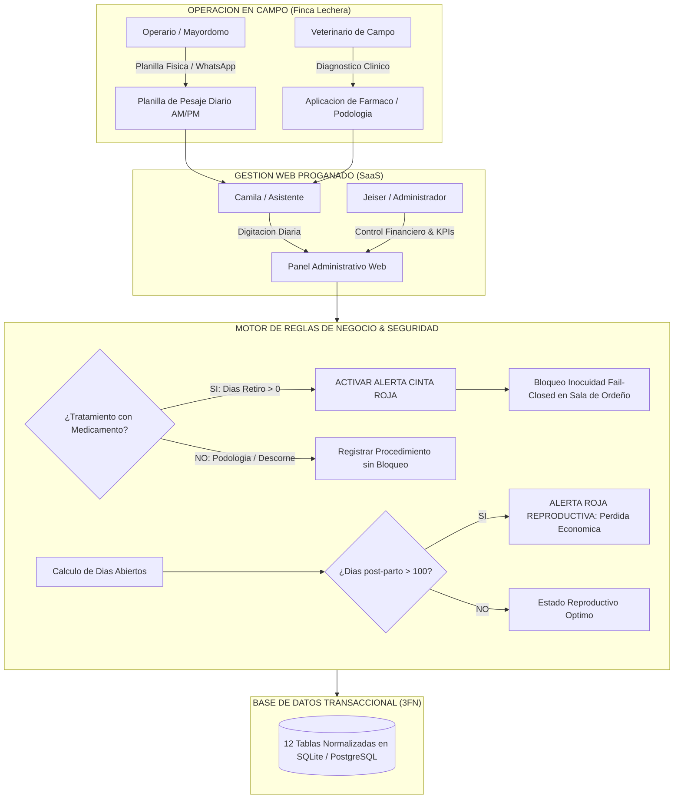
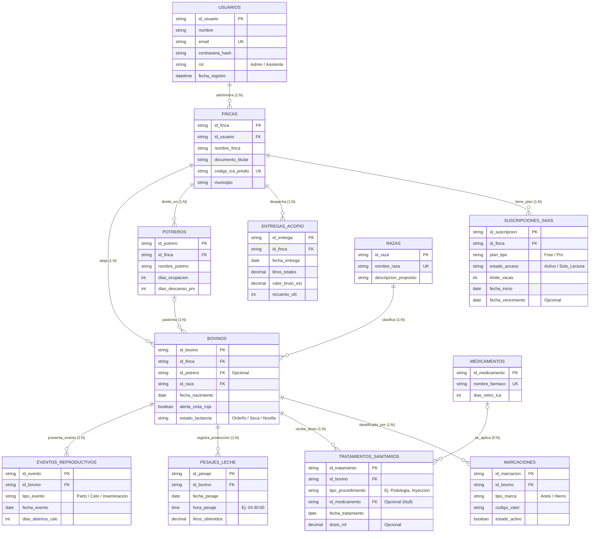

# 🐄 ProGanado SaaS — Sistema Integral de Gestión Ganadera & Inocuidad Lechera

> **SSOT (Single Source of Truth) — Arquitectura de Software, Modelo de Negocio, Reglas de Inocuidad & Base de Datos**  
> **Institución:** CESDE — Escuela de Tecnología e Innovación | Semestre 2026-2  
> **Proyecto Integrador:** Nivel 1 (Bases de Datos Relacionales, Algoritmia, Frontend Semántico & Emprendimiento Tech)  
> **Tech Lead & Arquitecto:** Jeiser Abraham Gutiérrez  
> **Repositorio Público de Verificación:** [https://github.com/jeiser270997-source/ProGanado](https://github.com/jeiser270997-source/ProGanado)  
> **Fecha de Entrega Momento 1:** Domingo, 30 de Agosto de 2026

---

> ### ⚠️ SALVEDADES ACADÉMICAS Y DE INGENIERÍA (ENTREGA MOMENTO 1)
> 1. **Capa Visual y Maquetación HTML5 (En Construcción Semántica Activa):** La capa visual se presenta como una especificación semántica pura (HTML5 estructurado sin frameworks pesados ni estilos CSS definitivos) asignada a **Sebastián Gómez**. Las 6 vistas del SaaS se encuentran en fase de maquetación modular activa siguiendo los blueprints de accesibilidad WCAG 2.1.
> 2. **Modelo Entidad-Relación y Relacional (Diseño Base Sujeto a Iteración Continua):** El diseño de la base de datos (MER Chen y Modelo Relacional de 12 tablas en 3FN) corresponde a la arquitectura de lanzamiento inicial. Dicho modelo se encuentra sujeto a refinamientos, normalizaciones complementarias y optimizaciones de índices según las pruebas de carga y retroalimentación de campo en el Momento 2.

---

## 📌 1. Visión del Producto y Problema Real del Campo

**ProGanado** es una plataforma SaaS B2B agropecuaria diseñada para transformar la administración empírica y en papel de las fincas lecheras de Colombia (especialmente en la cuenca norte de Antioquia: Santa Rosa de Osos, San Pedro de los Milagros, Entrerríos y Donmatías) en una operación de alta precisión, inocuidad biológica y rentabilidad financiera.

### 🛑 Dolores Críticos del Sector Lechero Resueltos:
1. **La "Pesadilla del Carrotanque" (Contaminación de Leche):** Si una vaca tratada con antibiótico es ordeñada por descuido y su leche entra al tanque comunal de la cooperativa (ej. Colanta), se contamina el viaje entero (10.000+ litros), generando sanciones económicas severas (> $25.000.000 COP) y veto temporal del predio.
2. **Pérdida de Dinero por "Días Abiertos" (> 100 días post-parto):** Cada día que una vaca pasa sin quedar preñada después de los 100 días posparto representa pérdidas de más de $35.000 COP/día en alimentación sin curva de producción futura.
3. **Pérdida de Trazabilidad e Historial por Aretes Caídos:** Las vacas frecuentemente pierden aretes físicos en los alambres de púas. Los sistemas tradicionales sobreescriben el código perdiendo el historial médico, lo cual viola la normativa oficial del ICA.
4. **Sub-pastoreo y Degradación de Suelos:** Falta de control estricto en la rotación de praderas bajo las Leyes del Pastoreo Racional Voisin (PRV).

---

## 💼 2. Modelo de Negocio SaaS & Pricing Tiers (Freemium)

El modelo de monetización se estructura **por FINCA** (Unidad Productiva / Código ICA Predio), permitiendo que un mismo inversionista o usuario administre múltiples predios con facturación independiente.

```
+-----------------------------------------------------------------------------------+
|                              ESQUEMA DE MONETIZACIÓN                              |
+------------------------------------+----------------------------------------------+
| FREE TIER (DataCrédito Ganadero)   | PRO TIER ($119.000 COP / mes por Finca)      |
+------------------------------------+----------------------------------------------+
| • Hasta 10 vacas en producción.    | • Capacidad hasta 500+ bovinos por predio.   |
| • Ficha zootécnica e historial.    | • Telemetría completa de curva de lactancia. |
| • Registro básico de pesajes.      | • Sistema de Bloqueo Inocuidad Cinta Roja.   |
| • 1 usuario administrativo.        | • Semáforo de Rotación Voisin (PRV).         |
| • Alertas básicas de celo.         | • Control de 100 Días Abiertos Reproductivos.|
| • Acceso permanente.               | • Multi-rol (Administrador + Asistente).     |
+------------------------------------+----------------------------------------------+
```

### 🔒 Política Anti-Deuda: *Zero Data Loss (Acceso Solo-Lectura)*
Si una finca en plan **Pro** no renueva su suscripción mensual:
- **NUNCA se borran datos ni animales.**
- El estado de la suscripción cambia automáticamente a `Solo_Lectura`.
- El productor puede consultar todo su histórico, pero no puede insertar nuevos pesajes ni tratamientos hasta reactivar el plan.

---

## 👥 3. Equipo de Trabajo & Roles de Ejecución (CESDE)

| Miembro del Equipo | Rol Principal | Responsabilidades Clave |
|---|---|---|
| **Jeiser Abraham Gutiérrez** | Tech Lead & Database Architect | Arquitectura de datos (3FN), backend API, integración de inocuidad y control de versiones Git. |
| **Sebastián Gómez** | Graphic Designer & Frontend Lead | UI/UX Pro Max, identidad visual, maquetación HTML5 semántica y responsive design. |
| **Camila Salas** | Administrative Assistant & Legal/Tax | Asistencia operativa, validación con planillas de campo, formalización S.A.S. (Ley 1780) y régimen tributario (0% IVA Cloud). |
| **Dr. Humberto Pinto** | Medical Doctor & Scientific Advisor | Asesoría médica/cardiológica, analogía de telemetría de precisión (Holter = Ordeño AM/PM) y pitch ante jurados. |
| **Emilio Villanueva** | Collections & Logic / PSeInt Lead | Algoritmia en PSeInt, validación de reglas de negocio en campo y recopilación de requerimientos. |

---

## 🏗️ 4. Pipeline de Arquitectura y Flujo de Operación



---

## 📐 5. Reglas de Negocio Estrictas (Grabadas en Piedra)

1. **Inocuidad Lechera y Cinta Roja (Fail-Closed):**
   - Todo tratamiento que utilice un medicamento con `dias_retiro_ica > 0` activa de inmediato el flag `bovinos.alerta_cinta_roja = 1`.
   - La alerta permanece activa hasta que `fecha_actual >= fecha_tratamiento + dias_retiro_ica`.
   - La leche de una vaca con Cinta Roja **nunca** debe sumarse al despacho de `entregas_acopio`.
2. **Tratamientos Sanitarios Flexibles (SaaS EHR):**
   - Soporta procedimientos clínicos **con medicamento** (antibióticos, desparasitantes) y **sin medicamento** (podología correctiva, corte de pezuñas, descorne).
   - `id_medicamento` y `dosis_ml` son opcionales (`NULL`).
   - `tipo_procedimiento` es obligatorio para describir la acción realizada.
3. **Telemetría Exacta de Ordeño (`hora_pesaje`):**
   - No se utiliza un discriminador genérico (AM/PM); se registra la hora exacta (`TIME`, ej: `04:30:00`) basada en la planilla física de campo.
4. **Trazabilidad 1:N de Identificaciones (`marcaciones`):**
   - Una vaca puede tener múltiples registros de marcación a lo largo de su vida (Arete ICA, Hierro Caliente, Chapeta, Tatuaje).
   - Si un arete se cae o se pierde, se marca `estado_activo = 0` y se registra el nuevo con `estado_activo = 1`, preservando el historial legal ante el ICA.
5. **Pastoreo Racional Voisin (PRV):**
   - Los potreros manejan tiempos estrictos: `dias_ocupacion` (típicamente 1 a 2 días) y `dias_descanso_prv` (30 a 40 días para recuperación biológica del pasto Kikuyo/Ryegrass).

---

## 🗃️ 6. Modelo de Datos Relacional Oficial (12 Tablas en 3FN)



---

## 💻 7. Script DDL SQL de Producción (3FN)

```sql
PRAGMA foreign_keys = ON;

-- 1. USUARIOS (Autenticación y Seguridad)
CREATE TABLE IF NOT EXISTS usuarios (
    id_usuario TEXT PRIMARY KEY,
    nombre TEXT NOT NULL,
    email TEXT NOT NULL UNIQUE,
    contrasena_hash TEXT NOT NULL,
    rol TEXT CHECK(rol IN ('Administrador', 'Asistente')) NOT NULL DEFAULT 'Administrador',
    fecha_registro DATETIME DEFAULT CURRENT_TIMESTAMP
);

-- 2. FINCAS (El Predio Ganadero)
CREATE TABLE IF NOT EXISTS fincas (
    id_finca TEXT PRIMARY KEY,
    id_usuario TEXT NOT NULL,
    nombre_finca TEXT NOT NULL,
    documento_titular TEXT NOT NULL,
    codigo_ica_predio TEXT NOT NULL UNIQUE,
    municipio TEXT NOT NULL DEFAULT 'Santa Rosa de Osos',
    FOREIGN KEY (id_usuario) REFERENCES usuarios(id_usuario) ON DELETE RESTRICT
);

-- 3. SUSCRIPCIONES SAAS (Modelo Freemium DataCrédito)
CREATE TABLE IF NOT EXISTS suscripciones_saas (
    id_suscripcion TEXT PRIMARY KEY,
    id_finca TEXT NOT NULL,
    plan_tipo TEXT CHECK(plan_tipo IN ('Free', 'Pro_119k')) NOT NULL DEFAULT 'Free',
    estado_acceso TEXT CHECK(estado_acceso IN ('Activo', 'Solo_Lectura')) NOT NULL DEFAULT 'Activo',
    limite_vacas INTEGER NOT NULL DEFAULT 10,
    fecha_inicio DATE NOT NULL,
    fecha_vencimiento DATE,
    FOREIGN KEY (id_finca) REFERENCES fincas(id_finca) ON DELETE CASCADE
);

-- 4. ENTREGAS ACOPIO (Despacho Diario Carrotanque Colanta)
CREATE TABLE IF NOT EXISTS entregas_acopio (
    id_entrega TEXT PRIMARY KEY,
    id_finca TEXT NOT NULL,
    fecha_entrega DATE NOT NULL,
    litros_totales DECIMAL(7,2) NOT NULL,
    valor_bruto_est DECIMAL(10,2) NOT NULL,
    recuento_ufc INTEGER,
    FOREIGN KEY (id_finca) REFERENCES fincas(id_finca) ON DELETE CASCADE
);

-- 5. POTREROS (Pastoreo Racional Voisin - PRV)
CREATE TABLE IF NOT EXISTS potreros (
    id_potrero TEXT PRIMARY KEY,
    id_finca TEXT NOT NULL,
    nombre_potrero TEXT NOT NULL,
    dias_ocupacion INTEGER NOT NULL DEFAULT 1,
    dias_descanso_prv INTEGER NOT NULL DEFAULT 35,
    FOREIGN KEY (id_finca) REFERENCES fincas(id_finca) ON DELETE CASCADE
);

-- 6. RAZAS (Catálogo Dinámico de Genética)
CREATE TABLE IF NOT EXISTS razas (
    id_raza TEXT PRIMARY KEY,
    nombre_raza TEXT NOT NULL UNIQUE,
    descripcion_proposito TEXT NOT NULL
);

-- 7. BOVINOS (Ficha Central Inmutable)
CREATE TABLE IF NOT EXISTS bovinos (
    id_bovino TEXT PRIMARY KEY,
    id_finca TEXT NOT NULL,
    id_potrero TEXT,
    id_raza TEXT NOT NULL,
    fecha_nacimiento DATE NOT NULL,
    alerta_cinta_roja BOOLEAN NOT NULL DEFAULT 0,
    estado_lactancia TEXT CHECK(estado_lactancia IN ('En_Ordeño', 'Horra_Seca', 'Novilla')) NOT NULL DEFAULT 'Novilla',
    FOREIGN KEY (id_finca) REFERENCES fincas(id_finca) ON DELETE CASCADE,
    FOREIGN KEY (id_potrero) REFERENCES potreros(id_potrero) ON DELETE SET NULL,
    FOREIGN KEY (id_raza) REFERENCES razas(id_raza) ON DELETE RESTRICT
);

-- 8. MARCACIONES (Aretes, Hierros, Chapetas Normalizados)
CREATE TABLE IF NOT EXISTS marcaciones (
    id_marcacion TEXT PRIMARY KEY,
    id_bovino TEXT NOT NULL,
    tipo_marca TEXT CHECK(tipo_marca IN ('Arete_ICA', 'Hierro_Caliente', 'Chapeta', 'Tatuaje')) NOT NULL,
    codigo_valor TEXT NOT NULL,
    estado_activo BOOLEAN NOT NULL DEFAULT 1,
    FOREIGN KEY (id_bovino) REFERENCES bovinos(id_bovino) ON DELETE CASCADE
);

-- 9. MEDICAMENTOS (Farmacopea e Inocuidad ICA)
CREATE TABLE IF NOT EXISTS medicamentos (
    id_medicamento TEXT PRIMARY KEY,
    nombre_farmaco TEXT NOT NULL UNIQUE,
    dias_retiro_ica INTEGER NOT NULL
);

-- 10. TRATAMIENTOS SANITARIOS (Control de Inocuidad y Disparador Cinta Roja)
CREATE TABLE IF NOT EXISTS tratamientos_sanitarios (
    id_tratamiento TEXT PRIMARY KEY,
    id_bovino TEXT NOT NULL,
    tipo_procedimiento TEXT NOT NULL,
    id_medicamento TEXT,
    fecha_tratamiento DATE NOT NULL,
    dosis_ml DECIMAL(5,2),
    FOREIGN KEY (id_bovino) REFERENCES bovinos(id_bovino) ON DELETE CASCADE,
    FOREIGN KEY (id_medicamento) REFERENCES medicamentos(id_medicamento) ON DELETE RESTRICT
);

-- 11. PESAJES LECHE (Telemetría de Curva de Lactancia)
CREATE TABLE IF NOT EXISTS pesajes_leche (
    id_pesaje TEXT PRIMARY KEY,
    id_bovino TEXT NOT NULL,
    fecha_pesaje DATE NOT NULL,
    hora_pesaje TIME NOT NULL,
    litros_obtenidos DECIMAL(5,2) NOT NULL,
    FOREIGN KEY (id_bovino) REFERENCES bovinos(id_bovino) ON DELETE CASCADE
);

-- 12. EVENTOS REPRODUCTIVOS (Control de los 100 Días Abiertos)
CREATE TABLE IF NOT EXISTS eventos_reproductivos (
    id_evento TEXT PRIMARY KEY,
    id_bovino TEXT NOT NULL,
    tipo_evento TEXT CHECK(tipo_evento IN ('Parto', 'Celo_Observable', 'Inseminacion', 'Palpacion')) NOT NULL,
    fecha_evento DATE NOT NULL,
    dias_abiertos_calc INTEGER,
    FOREIGN KEY (id_bovino) REFERENCES bovinos(id_bovino) ON DELETE CASCADE
);

-- ÍNDICES DE ALTO DESEMPEÑO
CREATE INDEX IF NOT EXISTS idx_bovinos_finca ON bovinos(id_finca);
CREATE INDEX IF NOT EXISTS idx_bovinos_cinta_roja ON bovinos(alerta_cinta_roja) WHERE alerta_cinta_roja = 1;
CREATE INDEX IF NOT EXISTS idx_pesajes_bovino_fecha ON pesajes_leche(id_bovino, fecha_pesaje);
CREATE INDEX IF NOT EXISTS idx_marcaciones_codigo ON marcaciones(codigo_valor);
CREATE INDEX IF NOT EXISTS idx_tratamientos_fecha ON tratamientos_sanitarios(fecha_tratamiento);
```

---

## ☁️ 8. Plan de Arquitectura y Escalabilidad Cloud (de $0 a AWS Enterprise)

ProGanado implementa una estrategia de infraestructura evolutiva **"Zero-Debt Architecture"**, iniciando con costos fijos de cero pesos y migrando a la nube de **Amazon Web Services (AWS)** a medida que la base de clientes de pago genere flujo de caja positivo:

```
+-----------------------------------------------------------------------------------+
|                        HOJA DE RUTA DE INFRAESTRUCTURA CLOUD                      |
+-----------------------------------------------------------------------------------+
| FASE 0: Lanzamiento CESDE ($0 COP/mes)                                            |
| * Frontend: GitHub Pages / Vercel ($0)                                            |
| * Backend: Node.js Express API en Render Free Tier ($0)                           |
| * Base de Datos: PostgreSQL en Supabase Free Tier ($0 / 500 MB)                   |
+-----------------------------------------------------------------------------------+
                                         |
                                         v (10 a 30 Clientes / Ingresos 1.2M-3.5M COP)
+-----------------------------------------------------------------------------------+
| FASE 1: Crecimiento Regional (~120k COP/mes)                                      |
| * Frontend: Cloudflare Pages CDN ($0)                                             |
| * Backend: VPS Gestionado Hetzner / Railway (~40k COP/mes)                        |
| * Base de Datos: Managed PostgreSQL con backups diarios (~80k COP/mes)            |
+-----------------------------------------------------------------------------------+
                                         |
                                         v (50 a 500+ Haciendas / Escala Nacional)
+-----------------------------------------------------------------------------------+
| FASE 2: AWS Enterprise High-Availability (~220k - 300k COP/mes)                   |
| * Frontend & Media: AWS S3 + AWS CloudFront (CDN global SSL)                      |
| * Cómputo API: AWS App Runner / ECS Fargate (Contenedores Docker Auto-escalables) |
| * Base de Datos: AWS RDS PostgreSQL (Multi-AZ, Failover y Cifrado AES-256)        |
| * Mensajería y Triggers: AWS EventBridge / AWS SNS (Alertas Celo/Cinta Roja)      |
| * Almacenamiento S3: Fotos de aretes, actas de vacunación ICA y reportes PDF      |
+-----------------------------------------------------------------------------------+
```

### Servicios AWS Clave en Fase 2:
1. **AWS S3:** Almacenamiento seguro para fotos de aretes, actas sanitarias del ICA y documentos PDF de soporte.
2. **AWS CloudFront:** Distribución CDN de baja latencia con certificados SSL automáticos para acceso rápido en zonas rurales 3G/4G.
3. **AWS App Runner / ECS Fargate:** Backend en contenedores Docker auto-escalables según horas de ordeño (4am y 2pm).
4. **AWS RDS PostgreSQL Multi-AZ:** Base de datos relacional administrada con copias de seguridad continuas y replicación síncrona.
5. **AWS EventBridge + SNS:** Disparador de notificaciones y alertas push SMS/WhatsApp para mayordomos y propietarios.

---

## 📂 9. Estructura de Carpetas del Repositorio

```text
ProGanado/
├── README.md                           # SSOT Arquitectura, Negocio, Reglas y DB
├── 01_Base_de_Datos_SQL/               # Scripts DDL, DML y Diagramas Relacionales
│   ├── schema_produccion_proganado_v3.sql
│   ├── proganado_mer.mmd
│   └── proganado_mr.dbml
├── 02_Vistas_HTML5/                    # Maquetación Semántica de Vistas del Frontend
│   ├── esqueleto_lego_semantico.html
│   └── registro_bovino.html
├── 03_Logica_PSeInt/                   # Algoritmia de Negocio y Control de Flujo
│   ├── asistente_logica_proganado_completo.psc
│   └── asistente_ganadero_refactorizado.psc
├── 04_Documentos_Sustentacion/         # Documento Maestro de Entrega Momento 1 (PDF y MD)
│   ├── PROGANADO_ENTREGA_MOMENTO_1_CESDE.pdf
│   └── PROGANADO_ENTREGA_MOMENTO_1_CESDE.md
└── docs/                               # Diagramas (.drawio), Guías PDF y Dossiers
    ├── diagramas/
    │   └── ER_PROGANADO.drawio         # MER Chen Oficial en Draw.io
    ├── GUIA_MAQUETACION_LANDING_PROGANADO_SEBASTIAN.pdf
    ├── GUIA_LEGAL_FINANCIERA_STARTUP_CAMILA.pdf
    └── GUIA_MEDICA_Y_ESTRATEGICA_DR_HUMBERTO_PINTO.pdf
```
