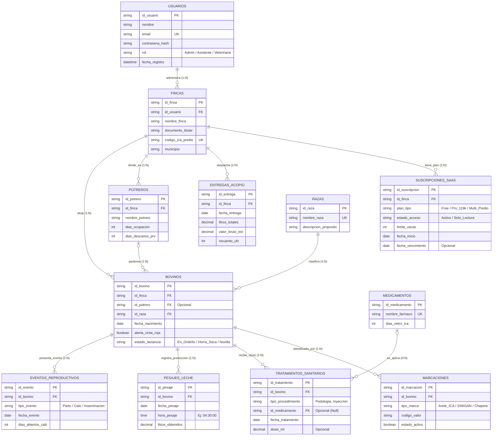

# 🐄 ProGanado — Sistema de Gestión Ganadera & Inocuidad Lechera

> **SSOT (Single Source of Truth) — Arquitectura de Software, Modelo de Datos Relacional 3FN & Proyecto Integrador CESDE**  
> **Institución Académica:** CESDE — Escuela de Tecnología e Innovación | Semestre 2026-2  
> **Proyecto Integrador:** Nivel 1 (Bases de Datos Relacionales, Algoritmia, Frontend Semántico, Tipado Fuerte & Emprendimiento Tech)  
> **Chief Technology Officer (CTO) & Arquitecto de Datos:** Jeiser Abraham Gutiérrez  
> **Repositorio Oficial:** [https://github.com/jeiserlabs/proganado](https://github.com/jeiserlabs/proganado)  
> **Estado Actual del Proyecto:** **FASE 1 — ESPECIFICACIÓN DE ARQUITECTURA, CONTRATOS DE DATOS & DDL 3FN** (Completada al 100% para Entrega Académica).  
> *Nota de Realidad Técnica:* Este repositorio representa la base formal de diseño de sistemas, tipos TypeScript, esquemas de validación en runtime Zod y modelado relacional normalizado. No constituye aún un SaaS comercial desplegado en producción (Fase 2: Backend API & Tests / Fase 3: Frontend Framework & Cloud).

---

> ### 📌 ALCANCE Y ESPECIFICACIÓN TÉCNICA (NIVEL 1 CESDE)
> 1. **Capa Visual y Maquetación HTML5:** Especificación semántica pura (HTML5 estructurado sin dependencias) para modelar la experiencia de usuario y validaciones en campo.
> 2. **Modelo Entidad-Relación y Relacional (12 Tablas 3FN):** DDL SQL estricto (`schema_produccion_proganado_v3.sql`) con soporte de integridad referencial estricta (`ON DELETE RESTRICT` para blindar la trazabilidad e historia clínica inmutable del bovino), telemetría de pesaje con hora exacta, control dinámico de inocuidad lechera (Cinta Roja) y módulo de conciliación de acopio contra tiquete de carrotanque (Colanta).

---

## 📚 DOCUMENTACIÓN MAESTRA DE LA S.A.S.

* 🐄 **[Estudio de Dominio y Rutinas de Campo](docs/ESTUDIO_DOMINIO_CAMPO.md):** SSOT de la operación real lechera (rutinas AM/PM, acopio Colanta, Cinta Roja, protocolo reproductivo y manejo de crías).
* 🛡️ **[Guía de Seguridad, Estabilidad y Escalabilidad](docs/GUIA_SEGURIDAD_Y_ESCALABILIDAD.md):** Protocolos anti-SQLi (Prepared Statements), concurrencia (`SELECT FOR UPDATE`), integridad referencial, deduplicación S3 y fases de escalado (1 a 10M+).
* 📋 **[Diccionario de Validación por Celda/Input](docs/DICCIONARIO_VALIDACION_INPUTS_Y_CELDAS.md):** Matriz de validación Zod, tipos TypeScript y restricciones para cada formulario y tabla.

---

## 📌 1. Visión del Producto y Problema Real del Campo

**ProGanado S.A.S.** es una plataforma SaaS B2B agropecuaria diseñada para transformar la administración empírica y en papel de las fincas lecheras de Colombia (especialmente en la cuenca norte de Antioquia: Santa Rosa de Osos, San Pedro de los Milagros, Entrerríos y Donmatías) en una operación de alta precisión, inocuidad biológica y rentabilidad financiera.

### 🛑 Dolores Críticos del Sector Lechero Resueltos:
1. **La "Pesadilla del Carrotanque" (Contaminación de Leche):** Si una vaca tratada con antibiótico es ordeñada por descuido y su leche entra al tanque comunal de la cooperativa (ej. Colanta), se contamina el viaje entero (10.000+ litros), generando sanciones económicas severas (> $25.000.000 COP) y veto temporal del predio.
2. **Pérdida de Dinero por "Días Abiertos" (> 100 días post-parto):** Cada día que una vaca pasa sin quedar preñada después de los 100 días posparto representa pérdidas de más de $35.000 COP/día en alimentación sin curva de producción futura.
3. **Pérdida de Trazabilidad e Historial por Aretes Caídos:** Las vacas frecuentemente pierden aretes físicos en los alambres de púas. Los sistemas tradicionales sobreescriben el código perdiendo el historial médico, lo cual viola la normativa oficial del ICA.
4. **Sub-pastoreo y Degradación de Suelos:** Falta de control estricto en la rotación de praderas bajo las Leyes del Pastoreo Racional Voisin (PRV).

---

## 🛡️ 2. Gobernanza de Datos & Tipado Fuerte (TypeScript & Zod)
Como **CTO y QA Lead**, la arquitectura de ProGanado implementa el principio de **Defensa en Profundidad (Defense in Depth)** y **Tolerancia Cero a Datos Corruptos**:

```
[ Entrada Operario / HTML5 ] 
          │  (Validación nativa: required, pattern, min/max)
          ▼
[ Esquema Zod en Runtime ] ──> Rechaza si: Litros <= 0, Fecha futura o Fármaco sin tiempo de retiro
          │  (src/schemas/validation.schemas.ts)
          ▼
[ Contrato TypeScript ] ─────> Cero 'any'. Tipado estricto de 12 entidades
          │  (src/types/domain.types.ts)
          ▼
[ Base de Datos 3FN ] ───────> Restricciones CHECK, NOT NULL, FK ON DELETE RESTRICT
```

* **Contratos TypeScript:** `src/types/domain.types.ts` (12 interfaces con enums zootécnicos).
* **Esquemas Zod:** `src/schemas/validation.schemas.ts` (Validación bidireccional en tiempo de ejecución).

---

## 💼 3. Modelo de Negocio SaaS & Pricing Tiers (Freemium)

El modelo de monetización se estructura **por FINCA** (Unidad Productiva / Código ICA Predio), permitiendo que un mismo inversionista o usuario administre múltiples predios con facturación independiente.

```
+-----------------------------------------------------------------------------------+
|                              ESQUEMA DE MONETIZACIÓN                              |
+------------------------------------+----------------------------------------------+
| FREE TIER (DataCrédito Ganadero)   | PRO TIER ($119.000 COP / mes por Finca)      |
+------------------------------------+----------------------------------------------+
| • Hasta 15 vacas en producción.    | • Capacidad hasta 500+ bovinos por predio.   |
| • Ficha zootécnica e historial.    | • Telemetría completa de curva de lactancia. |
| • Registro básico de pesajes.      | • Sistema de Bloqueo Inocuidad Cinta Roja.   |
| • 1 usuario administrativo.        | • Semáforo de Rotación Voisin (PRV).         |
| • Alertas básicas de celo.         | • Control de 100 Días Abiertos Reproductivos.|
| • Acceso permanente.               | • Multi-rol (Administrador + Asistente).     |
+------------------------------------+----------------------------------------------+
```

### 🔒 Política Anti-Deuda: *Zero Data Loss (Acceso Solo-Lectura)*
Si una finca en plan **Pro** no renueva su suscripción mensual:
- **NUNCA se borran datos ni animales.**
- El estado de la suscripción cambia automáticamente a `Solo_Lectura`.
- El productor puede consultar todo su histórico, pero no puede insertar nuevos pesajes ni tratamientos hasta reactivar el plan.

---

## 👥 4. Junta Fundadora & Equipo de Ejecución

| Miembro del Equipo | Cargo en la S.A.S. | Rol Académico CESDE | Responsabilidades Clave |
|---|---|---|---|
| **Jeiser Abraham Gutiérrez** | Chief Technology Officer (CTO) | Tech Lead & QA Lead | Arquitectura 3FN, gobernanza TypeScript, esquemas Zod, DDL SQL y roadmap Cloud AWS. |
| **Sebastián Correa** | Chief Design Officer (CDO) | Frontend Lead | UI/UX Pro Max, maquetación HTML5 semántica pura, accesibilidad WCAG 2.1 y blueprints. |
| **Camila Salas** | Chief Legal & Financial Officer (CLO/CFO) | Asistente Legal/Admin | Formalización S.A.S. (Ley 1780), Régimen Simple (RST 1.8%-5.4%) y 0% IVA Cloud. |
| **Dr. Humberto Pinto** | Chief Medical & Scientific Officer (CSO) | Asesor Médico & QA | Telemetría médica (pesaje AM/PM), protocolos de inocuidad y asesoría zootécnica. |
| **Emilio Villanueva** | Head of Operations (COO) | Lógica & PSeInt Lead | Algoritmia en PSeInt (Cinta Roja, Días Abiertos, Liquidación UFC) y validación de campo. |

---

## 🗃️ 5. Modelo de Datos Relacional Oficial (12 Tablas Extensibles en 3FN)



---

## 💻 6. Script DDL SQL de Producción (schema_produccion_proganado_v3.sql)

```sql
PRAGMA foreign_keys = ON;

-- 1. USUARIOS (Autenticación y Seguridad)
CREATE TABLE IF NOT EXISTS usuarios (
    id_usuario TEXT PRIMARY KEY,
    nombre TEXT NOT NULL,
    email TEXT NOT NULL UNIQUE,
    contrasena_hash TEXT NOT NULL,
    rol TEXT CHECK(rol IN ('Administrador', 'Asistente', 'Veterinario', 'Operario')) NOT NULL DEFAULT 'Administrador',
    fecha_registro DATETIME DEFAULT CURRENT_TIMESTAMP
);

-- 2. FINCAS (El Predio Ganadero)
CREATE TABLE IF NOT EXISTS fincas (
    id_finca TEXT PRIMARY KEY,
    id_usuario TEXT NOT NULL,
    nombre_finca TEXT NOT NULL,
    documento_titular TEXT NOT NULL,
    codigo_ica_predio TEXT NOT NULL UNIQUE,
    municipio TEXT NOT NULL DEFAULT 'Santa Rosa de Osos',
    FOREIGN KEY (id_usuario) REFERENCES usuarios(id_usuario) ON DELETE RESTRICT
);

-- 3. SUSCRIPCIONES SAAS (Modelo Freemium DataCrédito)
CREATE TABLE IF NOT EXISTS suscripciones_saas (
    id_suscripcion TEXT PRIMARY KEY,
    id_finca TEXT NOT NULL,
    plan_tipo TEXT CHECK(plan_tipo IN ('Free', 'Pro_119k', 'Multi_Predio_299k')) NOT NULL DEFAULT 'Free',
    estado_acceso TEXT CHECK(estado_acceso IN ('Activo', 'Solo_Lectura', 'Suspendido')) NOT NULL DEFAULT 'Activo',
    limite_vacas INTEGER NOT NULL DEFAULT 15,
    fecha_inicio DATE NOT NULL,
    fecha_vencimiento DATE,
    FOREIGN KEY (id_finca) REFERENCES fincas(id_finca) ON DELETE CASCADE
);

-- 4. ENTREGAS ACOPIO (Despacho Diario Carrotanque Colanta)
CREATE TABLE IF NOT EXISTS entregas_acopio (
    id_entrega TEXT PRIMARY KEY,
    id_finca TEXT NOT NULL,
    fecha_entrega DATE NOT NULL,
    litros_totales DECIMAL(7,2) NOT NULL,
    valor_bruto_est DECIMAL(10,2) NOT NULL,
    recuento_ufc INTEGER,
    FOREIGN KEY (id_finca) REFERENCES fincas(id_finca) ON DELETE CASCADE
);

-- 5. POTREROS (Pastoreo Racional Voisin - PRV)
CREATE TABLE IF NOT EXISTS potreros (
    id_potrero TEXT PRIMARY KEY,
    id_finca TEXT NOT NULL,
    nombre_potrero TEXT NOT NULL,
    dias_ocupacion INTEGER NOT NULL DEFAULT 1,
    dias_descanso_prv INTEGER NOT NULL DEFAULT 35,
    FOREIGN KEY (id_finca) REFERENCES fincas(id_finca) ON DELETE CASCADE
);

-- 6. RAZAS (Catálogo Dinámico de Genética)
CREATE TABLE IF NOT EXISTS razas (
    id_raza TEXT PRIMARY KEY,
    nombre_raza TEXT NOT NULL UNIQUE,
    descripcion_proposito TEXT NOT NULL
);

-- 7. BOVINOS (Ficha Central Inmutable)
CREATE TABLE IF NOT EXISTS bovinos (
    id_bovino TEXT PRIMARY KEY,
    id_finca TEXT NOT NULL,
    id_potrero TEXT,
    id_raza TEXT NOT NULL,
    fecha_nacimiento DATE NOT NULL,
    alerta_cinta_roja BOOLEAN NOT NULL DEFAULT 0,
    estado_lactancia TEXT CHECK(estado_lactancia IN ('En_Ordeño', 'Horra_Seca', 'Novilla', 'Crecimiento', 'Toro')) NOT NULL DEFAULT 'Novilla',
    FOREIGN KEY (id_finca) REFERENCES fincas(id_finca) ON DELETE CASCADE,
    FOREIGN KEY (id_potrero) REFERENCES potreros(id_potrero) ON DELETE SET NULL,
    FOREIGN KEY (id_raza) REFERENCES razas(id_raza) ON DELETE RESTRICT
);

-- 8. MARCACIONES (Aretes, Hierros, Chapetas Normalizados)
CREATE TABLE IF NOT EXISTS marcaciones (
    id_marcacion TEXT PRIMARY KEY,
    id_bovino TEXT NOT NULL,
    tipo_marca TEXT CHECK(tipo_marca IN ('Arete_ICA', 'Arete_SINIGAN', 'Chapeta_Manejo', 'Hierro_Caliente', 'Tatuaje', 'Chip_RFID')) NOT NULL,
    codigo_valor TEXT NOT NULL,
    estado_activo BOOLEAN NOT NULL DEFAULT 1,
    FOREIGN KEY (id_bovino) REFERENCES bovinos(id_bovino) ON DELETE CASCADE
);

-- 9. MEDICAMENTOS (Farmacopea e Inocuidad ICA)
CREATE TABLE IF NOT EXISTS medicamentos (
    id_medicamento TEXT PRIMARY KEY,
    nombre_farmaco TEXT NOT NULL UNIQUE,
    dias_retiro_ica INTEGER NOT NULL
);

-- 10. TRATAMIENTOS SANITARIOS (Control de Inocuidad y Disparador Cinta Roja)
CREATE TABLE IF NOT EXISTS tratamientos_sanitarios (
    id_tratamiento TEXT PRIMARY KEY,
    id_bovino TEXT NOT NULL,
    tipo_procedimiento TEXT NOT NULL,
    id_medicamento TEXT,
    fecha_tratamiento DATE NOT NULL,
    dosis_ml DECIMAL(5,2),
    FOREIGN KEY (id_bovino) REFERENCES bovinos(id_bovino) ON DELETE CASCADE,
    FOREIGN KEY (id_medicamento) REFERENCES medicamentos(id_medicamento) ON DELETE RESTRICT
);

-- 11. PESAJES LECHE (Telemetría de Curva de Lactancia)
CREATE TABLE IF NOT EXISTS pesajes_leche (
    id_pesaje TEXT PRIMARY KEY,
    id_bovino TEXT NOT NULL,
    fecha_pesaje DATE NOT NULL,
    hora_pesaje TIME NOT NULL,
    litros_obtenidos DECIMAL(5,2) NOT NULL,
    FOREIGN KEY (id_bovino) REFERENCES bovinos(id_bovino) ON DELETE CASCADE
);

-- 12. EVENTOS REPRODUCTIVOS (Control de los 100 Días Abiertos)
CREATE TABLE IF NOT EXISTS eventos_reproductivos (
    id_evento TEXT PRIMARY KEY,
    id_bovino TEXT NOT NULL,
    tipo_evento TEXT CHECK(tipo_evento IN ('Parto', 'Celo_Observable', 'Inseminacion', 'Palpacion', 'Aborto')) NOT NULL,
    fecha_evento DATE NOT NULL,
    dias_abiertos_calc INTEGER,
    FOREIGN KEY (id_bovino) REFERENCES bovinos(id_bovino) ON DELETE CASCADE
);

-- ÍNDICES DE ALTO DESEMPEÑO
CREATE INDEX IF NOT EXISTS idx_bovinos_finca ON bovinos(id_finca);
CREATE INDEX IF NOT EXISTS idx_bovinos_cinta_roja ON bovinos(alerta_cinta_roja) WHERE alerta_cinta_roja = 1;
CREATE INDEX IF NOT EXISTS idx_pesajes_bovino_fecha ON pesajes_leche(id_bovino, fecha_pesaje);
CREATE INDEX IF NOT EXISTS idx_marcaciones_codigo ON marcaciones(codigo_valor);
CREATE INDEX IF NOT EXISTS idx_tratamientos_fecha ON tratamientos_sanitarios(fecha_tratamiento);
```

---

## 📂 7. Estructura de Carpetas del Repositorio

```text
ProGanado/
├── README.md                           # SSOT Maestro de la S.A.S.
├── AGENTS.md                           # Contrato de aislamiento y reglas globales
├── src/                                # Código Fuente y Contratos Fuertemente Tipados
│   ├── types/
│   │   └── domain.types.ts             # 12 Interfaces TypeScript estrictas (Zero-Any)
│   └── schemas/
│       └── validation.schemas.ts       # Esquemas Zod en Runtime para prevención de errores
├── 01_Base_de_Datos_SQL/               # Scripts DDL de 12 tablas en 3FN y Diagramas
│   ├── schema_produccion_proganado_v3.sql
│   ├── proganado_mer.mmd
│   └── proganado_mr.dbml
├── 02_Vistas_HTML5/                    # Maquetación Semántica de Vistas del Frontend
│   ├── esqueleto_lego_semantico.html
│   └── registro_bovino.html
├── 03_Logica_PSeInt/                   # Algoritmia de Negocio y Control de Flujo
│   ├── asistente_logica_proganado_completo.psc
│   └── asistente_ganadero_refactorizado.psc
├── 04_Documentos_Sustentacion/         # Documentos de Entrega Oficial Momento 1
│   ├── 01_SEMANTICA_HTML5_PROGANADO_CESDE.pdf
│   ├── 02_MODELO_ENTIDAD_RELACION_CHEN_PROGANADO.pdf
│   ├── 03_MODELO_RELACIONAL_12_TABLAS_PROGANADO.pdf
│   └── PROGANADO_ENTREGA_MOMENTO_1_CESDE.pdf
└── docs/                               # Documentación Técnica y Dominio
    ├── ESTUDIO_DOMINIO_CAMPO.md        # Lógica real de la finca lechera y Colanta
    ├── GUIA_SEGURIDAD_Y_ESCALABILIDAD.md # Anti-SQLi, concurrencia y roadmap de nube
    ├── DICCIONARIO_VALIDACION_INPUTS_Y_CELDAS.md # Matriz de validación Zod / TypeScript
    ├── contexto/
    │   ├── ESTADO_VIVO_PROGANADO.md
    │   └── CEREBRO_PROGANADO.md
    └── diagramas/
        └── ER_PROGANADO.drawio
```
