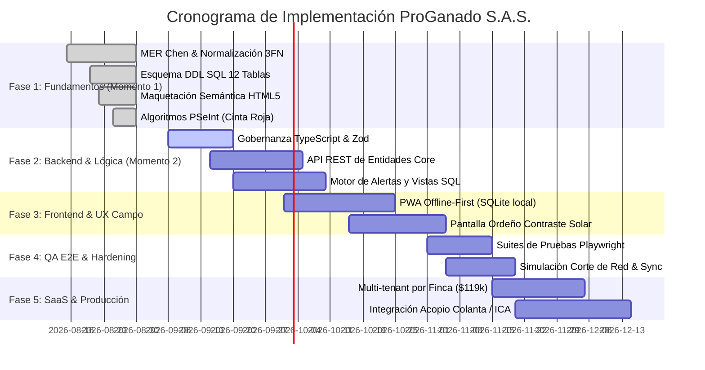

# 🗺️ Hoja de Ruta Cronológica de Implementación — ProGanado S.A.S.

> **SSOT de Evolución Técnica y Operativa**  
> **Proyecto:** ProGanado S.A.S. (Software Ganadero & Inocuidad Lechera)  
> **Tech Lead & QA Lead:** Jeiser Abraham Gutiérrez | CESDE Nivel 1  
> **Última Actualización:** 05-Septiembre-2026

---

## 📅 Diagrama Cronológico de Fases (Pipeline de Desarrollo)

---

## 🧭 Procedimiento Paso a Paso (Paso por Paso)

### 📌 FASE 1: Fundamentos de Datos y Arquitectura (COMPLETADA — Momento 1)
- [x] **Paso 1.1:** Levantamiento de requerimientos de campo (Santa Rosa de Osos / Cuenca Norte lechera).
- [x] **Paso 1.2:** Diseño del Modelo Entidad-Relación (MER Chen en Draw.io).
- [x] **Paso 1.3:** Normalización estricta a Tercera Forma Normal (3FN) con 12 tablas.
- [x] **Paso 1.4:** Codificación DDL SQL con llaves primarias, foráneas e índices (`schema_produccion_proganado_v3.sql`).
- [x] **Paso 1.5:** Implementación de Maquetación HTML5 semántica y Algoritmos en PSeInt.
- [x] **Paso 1.6:** Limpieza del repositorio y aislamiento de bocetos preliminares a `legacy_7_tablas/`.

---

### 📌 FASE 2: Backend, Tipado Fuerte y Motores de Negocio (EN CURSO — Momento 2)
- [ ] **Paso 2.1:** Configuración del entorno runtime (Node.js + TypeScript o Python FastAPI).
- [ ] **Paso 2.2:** Implementación de contratos TypeScript (`src/types/domain.types.ts`) y esquemas de validación Zod (`src/schemas/validation.schemas.ts`).
- [ ] **Paso 2.3:** Integración del Motor de Inocuidad Lechera:
  - Consumo de la vista dinámica `v_bovinos_cinta_roja`.
  - Disparador de bloqueo en tiempo real ante antibióticos activos.
- [ ] **Paso 2.4:** Cálculo automatizado de los **100 Días Abiertos** y alertas de celo (21 días).
- [ ] **Paso 2.5:** Endpoints CRUD para Fincas, Bovinos, Marcaciones, Pesajes y Tratamientos.

---

### 📌 FASE 3: Experiencia de Usuario de Campo & Arquitectura Offline-First
- [ ] **Paso 3.1:** Implementación de base de datos SQLite embebida en cliente (PWA / Capacitor).
- [ ] **Paso 3.2:** Conector de sincronización bidireccional (PowerSync / ElectricSQL) con resolución de conflictos Last-Write-Wins.
- [ ] **Paso 3.3:** Diseño de la interfaz de pesaje rápido para sala de ordeño:
  - Teclado numérico gigante para dedos con guantes.
  - Modo alto contraste solar (fondos blancos de alta luminancia para potreros bajo sol).
  - Alerta visual y sonora instantánea de Cinta Roja (pantalla roja bloqueante).

---

### 📌 FASE 4: QA Automation & Pruebas de Resiliencia (SDET First)
- [ ] **Paso 4.1:** Pruebas unitarias de validación Zod (rechazo de fechas futuras, litros negativos).
- [ ] **Paso 4.2:** Pruebas de integración de base de datos (restricciones FK, cascadas controladas).
- [ ] **Paso 4.3:** Prueba E2E de simulación de campo:
  - Playwright simula desconexión de red (`offline = true`).
  - Registro de 15 pesajes de ordeño matutino.
  - Reconexión de red y validación de sincronización íntegra en PostgreSQL central sin pérdida de datos.

---

### 📌 FASE 5: Monetización SaaS y Cumplimiento Normativo
- [ ] **Paso 5.1:** Activación del modelo Freemium (hasta 15 vacas en `suscripciones_saas`).
- [ ] **Paso 5.2:** Gatekeeper de suscripción Pro ($119.000 COP/mes por Finca).
- [ ] **Paso 5.3:** Módulo de exportación oficial de trazabilidad para el ICA (Resolución 20148).
- [ ] **Paso 5.4:** Conciliación automática de despachos con tiquetes de acopio Colanta.
