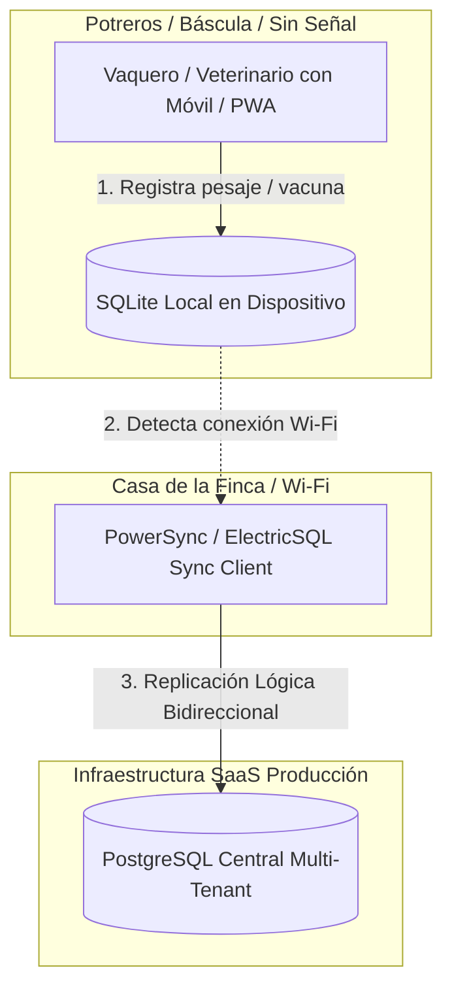

# Plan Maestro de Mejora & Arquitectura de Producción — ProGanado SaaS

> **ESTADO DEL DOCUMENTO:** Hoja de ruta técnica de arquitectura para escalado a producción.
> **REGLA DE ORO:** Este documento es una especificación de ingeniería; no altera el código fuente actual de la entrega académica del CESDE.

---

## 1. El Desafío Central del Campo: Arquitectura Offline-First

### Diagnóstico de la Realidad Rural (Antioquia / Córdoba):
En las fincas ganaderas, los potreros, corrales y básculas **NO cuentan con cobertura celular 4G/5G**.
Un software ganadero que dependa de conexión a internet constante para guardar un pesaje o un parto fracasa en el primer día de uso en campo.

### Solución de Producción: SQLite Local $\rightarrow$ PostgreSQL Central

### Tecnologías Recomendadas:
1. **Frontend / Cliente:** Next.js PWA instalable o Capacitor con SQLite embebido.
2. **Capa de Sincronización:** **`PowerSync`** (`powersync-js`) o **`ElectricSQL`**.
   - Permiten consultar y escribir localmente con queries SQL estándar.
   - Sincronizan cambios por streams lógicos con Postgres resolviendo conflictos por marcas temporales (LWW - Last Write Wins o CRDTs).

---

## 2. Motores de Negocio Ganadero (Inspirados en farmOS & moo)

### A. Cálculo Automatizado de Ganancia Diaria de Peso (GDP)
- **Fórmula:**
  $$\text{GDP (kg/día)} = \frac{\text{Peso Actual} - \text{Peso Anterior}}{\text{Días Transcurridos}}$$
- **Lógica de Alerta:**
  - Si $\text{GDP} < 0.65\text{ kg/día}$ en lote de ceba intensiva $\rightarrow$ Generar alerta nutricional/parasitaria.
  - Proyección automática de fecha óptima de salida a matadero/subasta al alcanzar 450-480 kg.

### B. Blindaje de Periodo de Retiro Veterinario (Alerta Colanta)
- **Riesgo:** Un solo litro de leche con residuos de antibiótico (ej: Oxitetraciclina, Penicilina) contamina el camión cisterna de Colanta $\rightarrow$ Decomiso total y multa de **$25M COP** al ganadero.
- **Guardrail de Software:**
  - Al registrar un medicamento en `REGISTRO_VACUNACION` con `dias_retiro > 0`:
    1. La vaca entra en estado `EN_RETIRO`.
    2. El módulo de ordeño bloquea físicamente el registro de leche comercial para esa vaca durante las horas de retiro.
    3. En la interfaz se pinta una **cinta roja** visual en la chapa del animal.

### C. Ciclos Reproductivos y Detección de Celo
- **Cronómetros Automáticos:**
  - Alerta a los **21 días** post-servicio (ventana de retorno al celo).
  - Alerta de pre-parto a los **270 días** de gestación (preparación de paritorio y lote de maternidad).

---

## 3. Experiencia Visual & UX/UI de Alto Contraste

1. **Dashboard Bento Grid:**
   - Organización en tarjetas asimétricas:
     - Tarjeta 1: Total Litros Hoy vs Ayer + Promedio por Vaca.
     - Tarjeta 2: Vacas en Retiro (Alerta Roja crítica).
     - Tarjeta 3: Distribución de Carga por Potrero (UA/ha - Unidades Gran Ganado por hectárea).
     - Tarjeta 4: Próximos Partos (Semana en curso).
2. **Diseño Solar / Outdoor Friendly:**
   - Soporte para **Modo Alto Contraste Solar** (fondos claros de alto contraste para visibilidad bajo la luz solar directa en potrero) además del **Dark Mode Natural** (`zinc-950`).
3. **Optimización Táctil para Dedos con Guantes:**
   - Botones de acción rápida grandes (mínimo 48x48 px).
   - Ingreso numérico simplificado para pesajes rápidos en báscula.

---

## 4. Estrategia de QA Automation First (SDET)

1. **Selectores Invariables:**
   - Todos los inputs y botones deben contar con `data-testid` explícitos:
     - `data-testid="input-numero-chapa"`
     - `data-testid="input-peso-bascula"`
     - `data-testid="btn-guardar-pesaje"`
2. **Pruebas de Sincronización Offline:**
   - Suites de Playwright que simulan corte de red (`context.setOffline(true)`), registran 10 animales, restauran la red y verifican que la BD PostgreSQL central contenga los 10 registros intactos.
